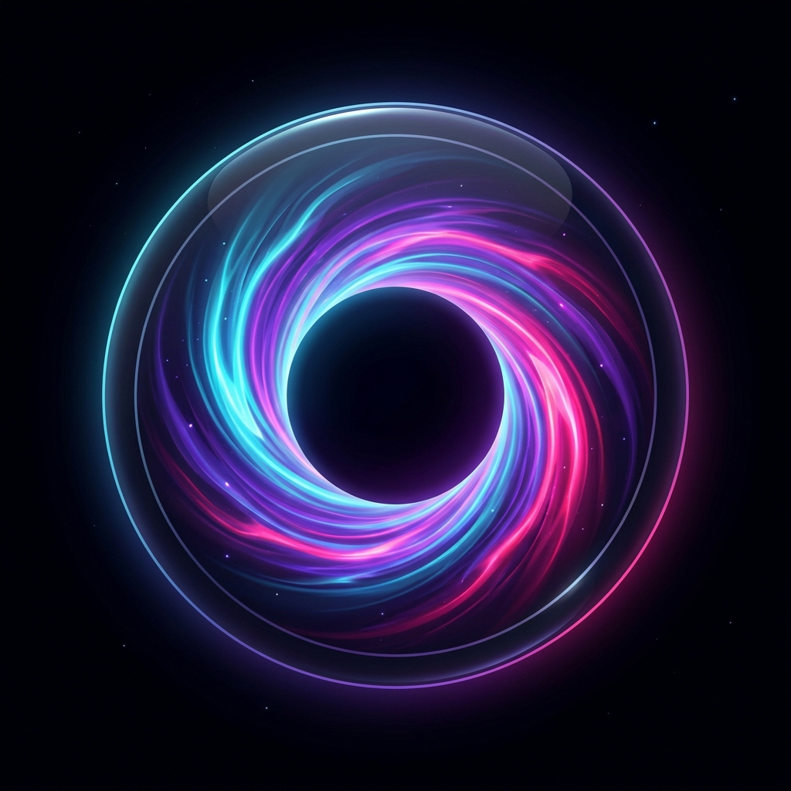

<p align="center">
  
</p>

# 🌌 SHADOW-IRC v4.0 Ultimate Deep Space Suite

[](LICENSE)
[](#protocol)
[](#tauri-v2)
[](#e2ee)
[](#services)
[](#cross-platform)

**SHADOW-IRC v4.0** is a 100% free and open-source (MIT) cross-platform IRC suite featuring a native **Tauri v2 Desktop App**, **24-bit TrueColor Terminal TUI Client**, built-in IRC Services (`NickServ`, `ChanServ`, `MemoServ`, `HostServ`), IRCv3 History Replay, ZNC-style 24/7 Bouncer, and IP Cloaking under a **Deep Space Cosmic Event Horizon** aesthetic.

---

## 🌟 SHADOW-IRC v3.0 Enterprise Features

1. **IRC Services Subsystem**:
   - **`NickServ`**: Password registration (`/ns REGISTER <pass> [email]`), identification (`/ns IDENTIFY <pass>`), and ghosting (`/ns GHOST <nick>`).
   - **`ChanServ`**: Channel registration (`/cs REGISTER #channel`), founder ownership rights, persistent topic lock, and auto-op access lists.
   - **`MemoServ`**: Offline private memo storage & delivery (`/ms SEND <nick> <msg>`, `/ms READ`).
   - **`HostServ`**: IP cloaking and vHost assignments (`/hs REQUEST <vhost>`).

2. **IRCv3 Specifications & Scrollback History Engine**:
   - Capabilities: `server-time`, `echo-message`, `message-tags`, `chathistory`, `sasl`, `account-notify`, `extended-join`.
   - **Ring Buffer History Engine**: Per-channel 500-item circular buffer with ISO-8601 UTC server timestamps. Replays missed scrollback when users join channels.

3. **ZNC-Style 24/7 Bouncer Session Engine**:
   - Persists user sessions when disconnected (`/bouncer enable`).
   - Buffers unread channel messages & DMs while offline, and automatically flushes playback upon reconnect and identification.

4. **Wildcard & CIDR Ban Mask Engine (`+b`)**:
   - Supports `nick!user@host` wildcard patterns (e.g. `*!*@192.168.1.*` or `troll*!*@*.vpn`).
   - Set channel ban: `/mode #channel +b <mask`
   - View ban list: `/mode #channel b`

---

## 🚀 Server Quick Start

Start the v3.0 dual-engine server daemon listening on TCP port `6667` and Web port `8888`:

```bash
./bin/shadow-ircd
```

*Output:*
```text
[SERVICES] Loaded registered accounts & channels.
[SHADOW-IRCD v3.0] Native TCP Engine on 0.0.0.0:6667 (Terminal & Desktop Apps)
[SHADOW-IRCD v3.0] Web Gateway & Embedded Client on http://0.0.0.0:8888 (Windows/macOS/Browser)
```

---

## ⌨️ Command Reference & Keyboard Shortcuts

### Supported IRC Commands
| Command | Description | Example |
|---|---|---|
| `/ns REGISTER <pass> [email]` | Register nickname with NickServ | `/ns REGISTER cosmicPass2026 me@shadow.net` |
| `/ns IDENTIFY <pass>` | Authenticate password | `/ns IDENTIFY cosmicPass2026` |
| `/cs REGISTER #channel` | Register channel with ChanServ | `/cs REGISTER #cosmos` |
| `/ms SEND <nick> <text>` | Send offline memo | `/ms SEND captain_jack Check logs` |
| `/ms READ` | Read offline memos | `/ms READ` |
| `/hs REQUEST <vhost>` | Request custom vHost | `/hs REQUEST shadow.cyber.cosmos` |
| `/bouncer enable` | Toggle 24/7 Bouncer persistence | `/bouncer enable` |
| `/encrypt <passphrase>` | Enable AES-256 E2EE for room | `/encrypt nebulaKey123` |
| `/mode #channel +b <mask>` | Ban wildcard mask | `/mode #cosmos +b *!*@192.168.1.*` |

---

## 📄 License

MIT License - 100% Free and Open Source.
